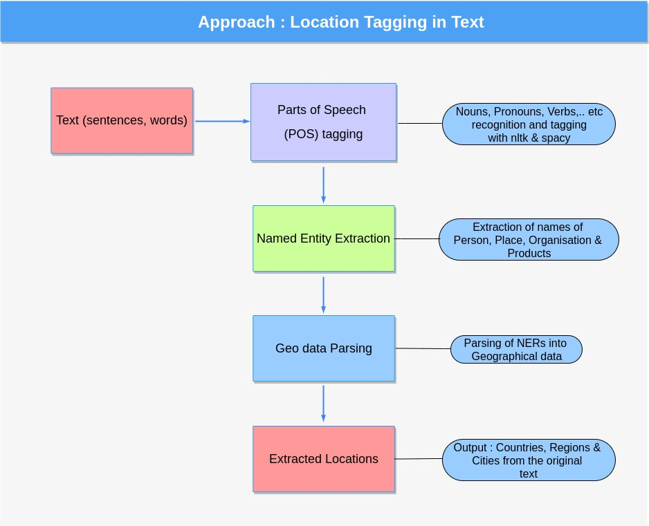

# locationtagger
**version 0.0.1**

Detect and extract locations (Countries, Regions/States & Cities) from text or URL. Also, find relationships among countries, regions & cities.

---
## About Project
In the field of [Natural Lauguage Processing](https://en.wikipedia.org/wiki/Natural_language_processing), many algorithms have been derived for different types of syntactic & semantic analysis of the textual data. NER ([Named Entity Recognition](https://en.wikipedia.org/wiki/Named-entity_recognition)) is one of the best & frequently needed tasks in real-world problems of text mining that follows some grammer-based rules & statistical modelling approaches. An entity extracted from NER can be a name of person, place, organization or product. [locationtagger](https://github.com/kaushiksoni10/locationtagger) is a further process of tagging & filter out place names (locations) amongst all the entities found with NER.

Approach followed is given below in the picture;

https://github.com/kaushiksoni10/locationtagger/blob/master/locationtagger/data/diagram.jpg?raw=true


---
## Install and Setup
**(Environment: python >= 3.5)**

Install the package using pip -

`pip install locationtagger`
 
But before we install the package, we need to install some useful libraries given below,

`nltk`

`spacy`

`newspaper3k`

`pycountry`

After installing these packages, there are some important nltk & spacy modules that need to be downloaded using commands given in `/locationtagger/bin/locationtagger-nltk-spacy` on IPython shell or Jupyter notebook.

---
## Usage
After proper installation of the package, import the module and give some text/URL as input;

### Text as input


```python
import locationtagger

text = "Unlike India and Japan, A winter weather advisory remains in effect through 5 PM along and east of a line from Blue Earth, to Red Wing line in Minnesota and continuing to along an Ellsworth, to Menomonie, and Chippewa Falls line in Wisconsin."

entities = locationtagger.find_locations(text = text)
```
\
Now we can grab all the place names present in above text,

```python
entities.countries
```
`['India', 'Japan']`

```python
entities.regions
```
`['Minnesota', 'Wisconsin']`

```python
entities.cities
```
`['Ellsworth', 'Red Wing', 'Blue Earth', 'Chippewa Falls', 'Menomonie']`

\
Apart from above places extracted from the text, we can also find the countries where these extracted `cities`, `regions` belong to,

```python
entities.country_regions
```
`{'United States': ['Minnesota', 'Wisconsin']}`

```python
entities.country_cities
```
`{'United States': ['Ellsworth',
  'Red Wing',
  'Blue Earth',
  'Chippewa Falls',
  'Menomonie']}`
  
 \
  Since "United States" is a country but not present in the text still came from the relations to the `cities` & `regions` present in the text, we can find it in `other_countries`,
  
  ```python
  entities.other_countries
  ```
  `['United States']`
  
 \
  If we are really serious about the `cities` we got in the text we can find which regions in the world it may fall in, 
  
  ```python
  entities.region_cities
  ```
  `{'Maine': ['Ellsworth'],
 'Minnesota': ['Red Wing', 'Blue Earth'],
 'Wisconsin': ['Ellsworth', 'Chippewa Falls', 'Menomonie'],
 'Pennsylvania': ['Ellsworth'],
 'Michigan': ['Ellsworth'],
 'Illinois': ['Ellsworth'],
 'Kansas': ['Ellsworth'],
 'Iowa': ['Ellsworth']}`

\
And obviously, we'll put these regions in `other_regions` since they are not present in original text,

```python
entities.other_regions
```
`['Maine',
 'Minnesota',
 'Wisconsin',
 'Pennsylvania',
 'Michigan',
 'Illinois',
 'Kansas',
 'Iowa']`
 
\
 Whatever words nltk & spacy both grabbed from the original text as [named entity](https://en.wikipedia.org/wiki/Named_entity) , most of them are stored in `cities`, `regions` & `countries`. But the remaining words (not recognized as place name) will be stored in `other`.
 
 ```python
 entities.other
 ```
 `['winter', 'PM', 'Chippewa']` 

### URL as Input 
Similarly, It can grab places from urls too, 

```python
URL = 'https://edition.cnn.com/2020/01/14/americas/staggering-number-of-human-rights-defenders-killed-in-colombia-the-un-says/index.html'
entities2 = locationtagger.find_locations(url = URL)
```
\
outputs we get:
countries;

```python
entities2.countries
```
`['Switzerland', 'Colombia']`

\
regions;

```python
entities2.regions
```
`['Geneva']`

\
cities;

```pyhton
entities2.cities
```
`['Geneva', 'Colombia']`

\
Now, if we want to check how many times a place has been mentioned or most common places which have been mentioned in the whole page of the URL, we can have an idea about what location that page is talking about;

hence, most commonly mentioned countries;

```python
entities2.country_mentions
```
`[('Colombia', 3), ('Switzerland', 1), ('United States', 1), ('Mexico', 1)]`

\
and most commonly mentioned cities;

```python
entities2.city_mentions
```
`[('Colombia', 3), ('Geneva', 1)]`

---

## Credits
[locationtagger](https://github.com/kaushiksoni10/locationtagger) uses data from following source for country, region & city lookups,

[GEOLITE2 free downloadable database](https://dev.maxmind.com/geoip/geoip2/geolite2/)

Apart from famous nlp libraries [NLTK](http://www.nltk.org/) & [spacy](https://spacy.io/), [locationtagger](https://github.com/kaushiksoni10/locationtagger) uses following very useful libraries;

[pycountry](https://github.com/flyingcircusio/pycountry)

[newspaper3k](https://github.com/codelucas/newspaper)
